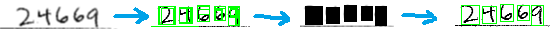
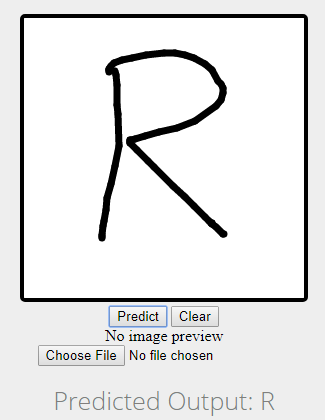
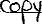
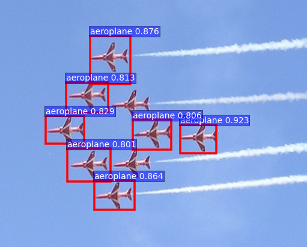

# Handwrting Recognization

## Demo

* Handwring Detecting  
  
* Handwring Recognization  
  

## Problems

* Low detecting rate - __51.026%__
* Low recognization rete - __88.68%__

## Thinking

* Low detecting rate
  * Deeply detecting  
    
  * Change to the better detecting arithmetic
    * SelectiveSearch  
      
* Low recognization rate
  * Optimize super-parameters
  * Strong the neuron network

## Expect

A prototype program has the abbiltity to scan the handwring paper and display the recognization result on the UI
